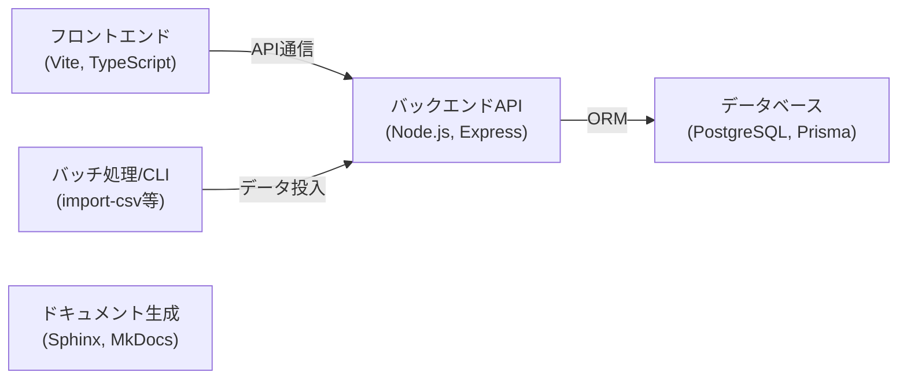

# インフルエンサーAPIドキュメントへようこそ

これはインフルエンサーAPIドキュメントのメインページです。

## システム構成図

```mermaid
flowchart LR
  FE["フロントエンド<br/>(Vite, TypeScript)"] -- API通信 --> BE["バックエンドAPI<br/>(Node.js, Express)"]
  BE -- ORM --> DB["データベース<br/>(PostgreSQL, Prisma)"]
  CLI["バッチ処理/CLI<br/>(import-csv等)"] -- データ投入 --> BE
  DOC["ドキュメント生成<br/>(Sphinx, MkDocs)"]
```

[APIリファレンスはこちら](typedoc/)
